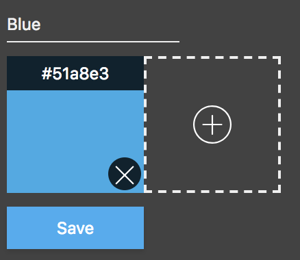

# color-palette
A chrome extension to save and use color palettes

## Getting Started
Download the files from github by either cloning this repo or download a release.
```
git clone https://github.com/nishanbajracharya/color-palette.git
```

Now open chrome and goto the chrome extensions page `chrome://extensions`.
There enable `developer mode` in the top right.

Next click the `LOAD UNPACKED` button and select the directory you downloaded from github. Normally this would be `color-palette`.

The extension is now installed.

## How to use
The extension opens up a popup when clicked through the toolbar.


Hovering on the color box will show the hex color code and clicking will copy the color code into the clipboard.

The Plus icon on the top right will open a new palette dialog.


Here you can enter the Palette name and click on the plus button to create a color. The you enter the hex value on the top or click the delete button to delete the color.



Then save the palette.
* Note: You need to enter both the name and atleast one color to save.

You can also delete a palette you have created by clicking on the delete icon on the top right of each palette.

## Contributing
To contribute, follow one of the two options:

- **Open an Issue**

  Open an issue detailing:
  1. What the issue is
  2. Steps to reproduce
  3. Possible solutions

  Note: These details are recommended but are entirely optional.

- **Send a Pull Request**

  Fork this project and send a pull request to the `master` branch.

## License
MIT
